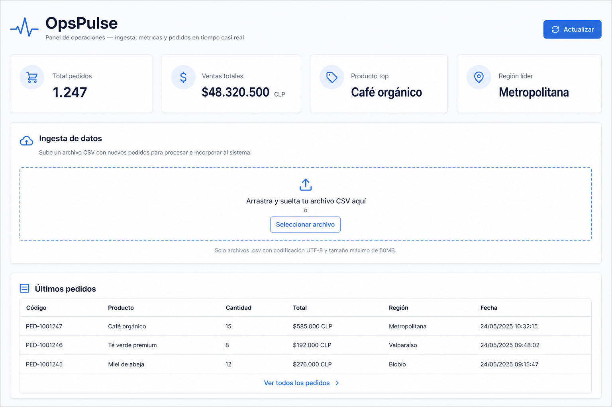
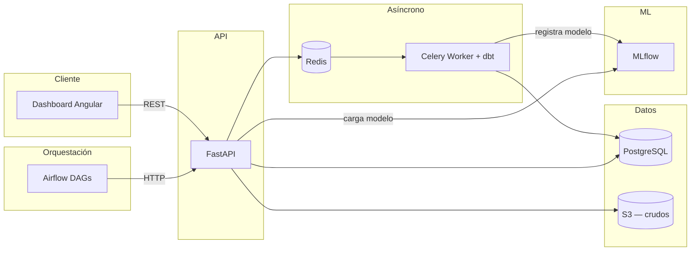

# OpsPulse

[](https://github.com/Catussi/opspulse/actions/workflows/ci-backend.yml)
[](https://github.com/Catussi/opspulse/actions/workflows/terraform.yml)

Plataforma de operaciones **data-driven** para retail: ingesta de pedidos, procesamiento asíncrono, transformaciones analíticas, métricas operativas y reglas de automatización. La construí para demostrar en un solo repositorio el flujo que aplico entre backend Python, ingeniería de datos y despliegue en la nube.

**Autora:** [Catalina E. Barría Otto](https://www.linkedin.com/in/catalinabarriaotto/) · [GitHub @Catussi](https://github.com/Catussi)



## Qué resuelve

OpsPulse modela el ciclo operativo de un negocio retail de punta a punta:

| Etapa | Qué hace |
|-------|----------|
| **Ingesta** | Carga de pedidos vía CSV o API, con auditoría de cada evento |
| **ETL asíncrono** | Validación y persistencia en background con Celery |
| **Transformaciones** | Modelos dbt (`staging` → `intermediate` → `marts`) |
| **Orquestación** | DAGs de Airflow que disparan pipelines vía API |
| **Métricas** | KPIs agregados consumidos por el dashboard Angular |
| **Automatización** | Reglas de negocio con webhooks (alertas por ventas bajas, etc.) |
| **Infraestructura** | Terraform para AWS (S3, RDS PostgreSQL, ECS Fargate) |
| **Observabilidad** | Métricas Prometheus y dashboards Grafana |

## Stack

| Capa | Tecnología |
|------|------------|
| Backend | Python 3.12, FastAPI, SQLAlchemy, Alembic, Pydantic |
| Cola de trabajos | Redis, Celery, Flower |
| Base de datos | PostgreSQL 16 |
| Frontend | Angular 19, TypeScript |
| Transformaciones | dbt |
| Orquestación | Apache Airflow |
| Contenedores | Docker Compose |
| Infraestructura | Terraform AWS (S3, RDS, ECS, IAM, CloudWatch) |
| Machine learning | MLflow, scikit-learn |
| Observabilidad | Prometheus, Grafana |
| CI/CD | GitHub Actions |

## Arquitectura



Airflow **no ejecuta dbt directamente**: los DAGs llaman a la API (`POST /api/v1/transformaciones/ejecutar-dbt`) y Celery corre `dbt run` en el worker. Así evito conflictos de dependencias y builds pesados en la imagen de Airflow.

## Cómo ejecutarlo

### Requisitos

- Docker Desktop
- (Opcional) Node.js 20+ para el frontend fuera de Docker

### Con Docker (recomendado)

```powershell
docker compose up --build
```

| Servicio | URL |
|----------|-----|
| API y OpenAPI | http://localhost:8001/api/docs |
| Flower (Celery) | http://localhost:5555 |
| MLflow | http://localhost:5000 |
| Prometheus (perfil `observabilidad`) | http://localhost:9090 |
| Grafana (perfil `observabilidad`) | http://localhost:3000 — `admin` / `admin` |
| Métricas API | http://localhost:8001/metrics |
| Frontend | http://localhost:4200 |
| PostgreSQL (host) | `localhost:5433` |
| Airflow (perfil `datos`) | http://localhost:8081 — `admin` / `admin` |

> Los puertos 8001 y 5433 evitan conflictos con otros contenedores locales (8000 y 5432).

### Probar ingesta de un CSV

```powershell
curl -X POST "http://localhost:8001/api/v1/ingesta/csv" `
  -H "accept: application/json" `
  -H "Content-Type: multipart/form-data" `
  -F "archivo=@datos/ejemplo/pedidos_ejemplo.csv"
```

### Transformaciones dbt

```powershell
docker compose run --rm dbt run
```

Materializa `marts.mart_resumen_pedidos`, que la API prioriza para los KPIs del dashboard (con fallback a SQL operacional).

### Airflow (opcional)

```powershell
docker compose --profile datos up airflow
```

DAGs incluidos: `transformaciones_dbt` (diario 06:00), `evaluar_reglas_automatizacion` (cada 15 min) y `entrenar_modelo_ml` (domingos 03:00).

### Machine learning (MLflow)

```powershell
# 1. Entrenar (requiere pedidos en la BD — seed o CSV)
curl -X POST "http://localhost:8001/api/v1/ml/entrenar?asincrono=false"

# 2. Predecir monto de un pedido hipotético
curl -X POST "http://localhost:8001/api/v1/ml/predecir-venta" `
  -H "Content-Type: application/json" `
  -d "{\"producto\":\"Laptop Pro 14\",\"cantidad\":2,\"region\":\"Santiago\",\"fecha_pedido\":\"2026-06-10T12:00:00Z\"}"
```

UI de experimentos: http://localhost:5000. Detalle en [modelado/README.md](modelado/README.md).

### Observabilidad (Prometheus + Grafana)

```powershell
docker compose --profile observabilidad up --build
```

Dashboard provisionado en Grafana: **OpsPulse — Operaciones** (latencia API, Celery, Redis y contadores de negocio). Detalle en [observabilidad/README.md](observabilidad/README.md).

### Desarrollo local

<details>
<summary>Backend, frontend y scripts</summary>

**Backend**

```powershell
cd backend
py -m venv .venv
.\.venv\Scripts\Activate.ps1
pip install -r requirements.txt
copy .env.ejemplo .env
py scripts/sembrar_datos.py
py -m uvicorn aplicacion.principal:aplicacion --reload
```

**Frontend**

```powershell
cd frontend
npm install
npm start
```

</details>

## API principal

| Método | Endpoint | Descripción |
|--------|----------|-------------|
| `GET` | `/metrics` | Métricas Prometheus (API + negocio) |
| `GET` | `/salud` | Health check |
| `POST` | `/api/v1/ingesta/csv` | Ingesta asíncrona de pedidos |
| `GET` | `/api/v1/metricas/resumen-pedidos` | KPIs del dashboard |
| `POST` | `/api/v1/transformaciones/ejecutar-dbt` | Dispara `dbt run` vía Celery |
| `POST` | `/api/v1/automatizacion/evaluar` | Evalúa reglas y dispara webhooks |
| `POST` | `/api/v1/ml/entrenar` | Entrena modelo de ventas (Celery o sync) |
| `POST` | `/api/v1/ml/predecir-venta` | Predice monto de un pedido |

Documentación interactiva en `/api/docs`.

## Estructura del repositorio

```
opspulse/
├── backend/aplicacion/       # API FastAPI, servicios, tareas Celery
├── frontend/                 # Dashboard Angular
├── transformaciones/dbt/     # Modelos SQL analíticos
├── orquestacion/airflow/     # DAGs programados
├── infra/terraform/          # IaC AWS
├── datos/ejemplo/            # CSV de demostración
├── modelado/                 # Entrenamiento ML y notas
├── observabilidad/           # Prometheus, Grafana y dashboards
├── docs/                     # Arquitectura, convenciones e imágenes
└── .github/workflows/        # CI backend y validación Terraform
```

## Roadmap

| Fase | Componente | Estado |
|------|------------|--------|
| MVP | FastAPI + Celery + PostgreSQL + Docker | ✅ |
| V2 | Dashboard Angular | ✅ |
| V3 | dbt + Airflow | ✅ |
| V4 | Terraform AWS (ECS, RDS, S3) | ✅ |
| V5 | MLflow + endpoint predictivo | ✅ |
| V6 | Prometheus + Grafana | ✅ |

## Convenciones

El dominio de negocio está nombrado en español (`ServicioPedidos`, `eventos_ingesta`). Los comentarios del código documentan decisiones y flujos. Detalle en [docs/CONVENCIONES_CODIGO.md](docs/CONVENCIONES_CODIGO.md).

## Documentación adicional

- [Arquitectura y decisiones técnicas](docs/ARQUITECTURA.md)
- [Terraform AWS](infra/terraform/README.md)
- [dbt](transformaciones/dbt/README.md)
- [Airflow](orquestacion/airflow/README.md)
- [Modelado ML](modelado/README.md)
- [Observabilidad](observabilidad/README.md)

## Sobre este proyecto

OpsPulse es un proyecto de portfolio orientado a roles de **Full Stack**, **Backend Python**, **Data Engineer** y **Cloud/DevOps**. Combina patrones que he aplicado en producción — colas, capas separadas, pipelines analíticos e infraestructura como código — en un dominio retail coherente y ejecutable de punta a punta.

Otros repositorios míos: [ELVIR-Demo](https://github.com/Catussi/ELVIR-Demo) (FastAPI + ML en salud).
