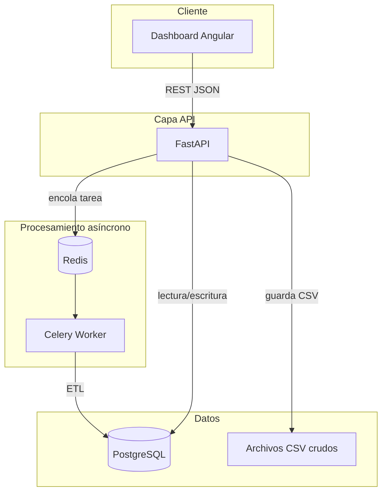

# Arquitectura — OpsPulse

## Visión general

OpsPulse modela el flujo operativo de un negocio retail: el dashboard Angular consume una API FastAPI, la ingesta pesada corre en workers Celery y PostgreSQL concentra pedidos, auditoría de cargas y reglas de automatización.

Prioricé patrones que he visto en entornos reales — colas, capas separadas, health checks, auditoría de ingesta — en lugar de un CRUD aislado.



## Flujo de ingesta CSV

1. `POST /api/v1/ingesta/csv` recibe el archivo.  
2. `ServicioIngesta` persiste el CSV y registra un `EventoIngesta` para auditoría.  
3. Se encola la tarea `procesar_archivo_csv` en Celery.  
4. El worker valida columnas, inserta pedidos y actualiza el estado del evento.  
5. El frontend puede consultar `GET /api/v1/ingesta/eventos/{id}` para seguir el progreso.

## Modelo de datos (MVP)

| Tabla | Propósito |
|-------|-----------|
| `pedidos` | Ventas individuales con producto, cantidad, región y fecha |
| `eventos_ingesta` | Historial de cargas CSV con filas exitosas y rechazadas |
| `reglas_automatizacion` | Condiciones de negocio configurables y destino webhook |

## Capas del backend

| Carpeta | Responsabilidad |
|---------|-----------------|
| `rutas/` | Endpoints HTTP; sin lógica de negocio |
| `servicios/` | Reglas de negocio y orquestación |
| `modelos/` | Mapeo ORM a PostgreSQL |
| `esquemas/` | Validación de entrada y salida (Pydantic) |
| `trabajos/` | Tareas Celery: ETL y automatización |

## Estado del proyecto

| Fase | Componente | Estado |
|------|------------|--------|
| MVP | FastAPI + Celery + PostgreSQL + Docker | Implementado |
| V2 | Dashboard Angular | Implementado |
| V3 | dbt + Airflow | Implementado |
| V4 | Terraform AWS (ECS, RDS, S3) | Implementado |
| V5 | MLflow + endpoint predictivo | Implementado |
| V6 | Prometheus + Grafana | Planificado |

## Decisiones de diseño

### FastAPI como framework de la API

Elegí FastAPI por el tipado con Pydantic, la generación automática de OpenAPI y la integración directa con SQLAlchemy. Ya lo había usado en producción en [ELVIR-Demo](https://github.com/Catussi/ELVIR-Demo); aquí lo apliqué a un dominio distinto (operaciones retail) manteniendo la misma separación por capas.

### Redis + Celery para procesamiento asíncrono

La ingesta CSV no debe bloquear la respuesta HTTP. Redis actúa como broker y Celery ejecuta el ETL en background, con reintentos y trazabilidad vía Flower. Kafka sería el siguiente paso si el volumen de eventos lo justificara; para este alcance Celery cubre el patrón sin sobredimensionar la infraestructura.

### Dominio nombrado en español

Los servicios, modelos y tablas usan español (`ServicioPedidos`, `eventos_ingesta`) porque el negocio que modelé es local y quiero que el código se lea como documentación del dominio. Las rutas REST y las librerías mantienen convenciones estándar de la industria.

### Angular en el frontend

El panel consume la API REST y delega agregaciones al backend. Usé Angular 19 por consistencia con otros proyectos míos (ELVIR, sistemas enterprise) y por la estructura modular que necesitaba para separar servicios, modelos y páginas.

## Despliegue objetivo

```
GitHub Actions  →  build y push de imágenes Docker
Terraform       →  ECS Fargate, RDS PostgreSQL, S3
Vercel          →  frontend Angular
Airflow         →  orquestación de pipelines ETL programados
```

La configuración de Terraform y los DAGs de Airflow están en sus carpetas respectivas dentro del repositorio.

## Machine learning (fase 5)

### Caso de uso

Predicción del **monto total de venta** (`cantidad × precio`) a partir de producto, región, cantidad y día de la semana. El modelo aprende patrones de precio promedio por producto/región sobre pedidos históricos en PostgreSQL.

### Flujo

1. `POST /api/v1/ml/entrenar` encola (o ejecuta) entrenamiento en Celery.  
2. El worker lee `pedidos`, entrena un pipeline sklearn y registra el artefacto en **MLflow** (`modelo-prediccion-ventas`).  
3. `POST /api/v1/ml/predecir-venta` carga el modelo desde el registry y devuelve el monto estimado.  
4. El DAG `entrenar_modelo_ml` re-entrena semanalmente vía Airflow.

### Por qué MLflow

Centraliza experimentos, métricas (MAE, RMSE) y versionado del modelo sin acoplar el código de inferencia a un archivo `.joblib` suelto. Es el mismo patrón que usaría en un entorno con varios experimentos y despliegues graduales.
